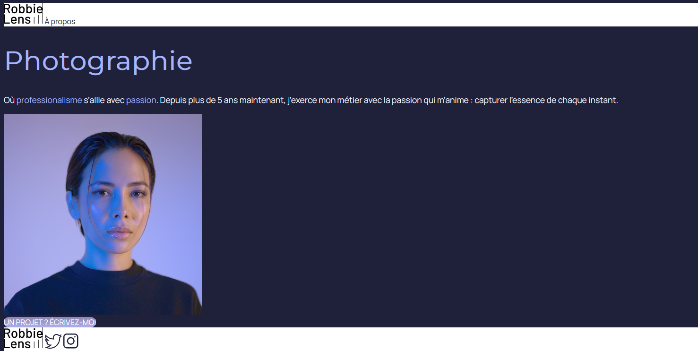

# 📷 Projet Portofolio Robbie Lens

Debut du projet : 03/02/24

Fin du projet :

##

Ce projet consiste à créer le portofolio d'une photographe professionelle en HTML et CSS et SCSS.

### Mission Front End

#### Fonctionnalités indispensables

#### Fonctionnalités souhaitables

### Informations diverses

- Ne pas connecter la plateforme à un système de paiement.

### Mega Death Bonus

## Pourquoi

## Quand

Le projet doit être terminé dans le délai imparti. Assurez-vous d'un progrès régulier et de mises à jour fréquentes sur le dépôt GitHub.

## Comment

## Qui

## Tâches en attente

## Étapes
